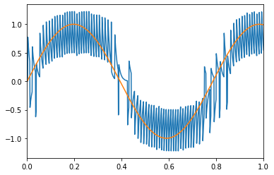
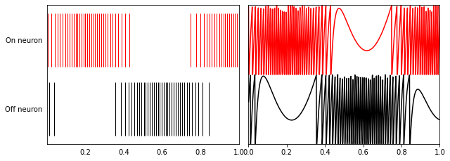

# 두개의 뉴런

이 데모 코드는 상호 보완 관계의 뉴런 쌍을 어떻게 구축하고 조절하는지 보여줍니다.

이 뉴런들은 LIF\(leaky integrate-and-fire\) 뉴런들입니다. 뉴런의 튜닝 설정을 사용해서 하나의 뉴런은 'on'이고, 다른 뉴런은 'off'입니다.   

첫번째 뉴런은 양의 입력값에 따라 증가할 것이고, 다른 뉴런은 감소할 것입니다. 이것은  하나의 스칼라 값을 논리적으로 표현할 수 있는 가장 단순한 집단으로 볼 수 있습니다.

```python
%matplotlib inline
import matplotlib.pyplot as plt
import numpy as np

import nengo
from nengo.dists import Uniform
from nengo.utils.matplotlib import rasterplot
```

### 1 단계: 뉴런의 생성

```python
model = nengo.Network(label='Two Neurons')
with model:
    neurons = nengo.Ensemble(
        # 1D scalar 값으로 표현
        2, dimensions=1, 
        # 인터셉트를 .5로 설정
        intercepts=Uniform(-.5, -.5),  
        # 최대 발화주기를 100hz로 설정
        max_rates=Uniform(100, 100),  
        # 뉴런 하나는 'on', 다른 하나는 'off'로 설정
        encoders=[[1], [-1]])  
```

### 2 단계: 모델을 위한 입력 생성

사인파를 발생시키는 입력 노드 생성

```python
with model:
    sin = nengo.Node(lambda t: np.sin(8 * t))
```

### 3 단: 네트워크 요소들을 연결

```python
with model:
    nengo.Connection(sin, neurons, synapse=0.01)
```

### 4 단계: 프로브 출력

관찰되는 모든 것은 시간별로 생성되는 데이타로 수집되어 추후에 분석 및 시각화할 수 있다. 

```python
with model:
    sin_probe = nengo.Probe(sin)  # The original input
    spikes = nengo.Probe(neurons.neurons)  # Raw spikes from each neuron
    # Subthreshold soma voltages of the neurons
    voltage = nengo.Probe(neurons.neurons, 'voltage')
    # Spikes filtered by a 10ms post-synaptic filter
    filtered = nengo.Probe(neurons, synapse=0.01)
```

### Step 5: Run the model

```python
with nengo.Simulator(model) as sim:  # Create a simulator
    sim.run(1)  # Run it for 1 second
```

### Step 6: Plot the results

```python
t = sim.trange()

# Plot the decoded output of the ensemble
plt.figure()
plt.plot(t, sim.data[filtered])
plt.plot(t, sim.data[sin_probe])
plt.xlim(0, 1)

# Plot the spiking output of the ensemble
plt.figure(figsize=(10, 8))
plt.subplot(2, 2, 1)
rasterplot(t, sim.data[spikes], colors=[(1, 0, 0), (0, 0, 0)])
plt.yticks((1, 2), ("On neuron", "Off neuron"))
plt.ylim(2.5, 0.5)

# Plot the soma voltages of the neurons
plt.subplot(2, 2, 2)
plt.plot(t, sim.data[voltage][:, 0] + 1, 'r')
plt.plot(t, sim.data[voltage][:, 1], 'k')
plt.yticks(())
plt.axis([0, 1, 0, 2])
plt.subplots_adjust(wspace=0.05);
```





상단의 그래프는 입력 신호\(녹색\)와 두개의 뉴런들로부터 필터링된 출력 스파이크들\(파란색\)을 보여준다.

The top graph shows the input signal in green and the filtered output spikes from the two neurons population in blue. The spikes \(that are filtered\) from the ‘on’ and ‘off’ neurons are shown in the bottom graph on the left. On the right are the subthreshold voltages for the neurons.

